# Project Workflow Diagrams

## AgriFore

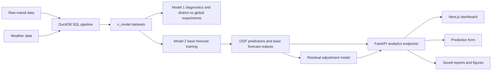

## FlightFinder AI

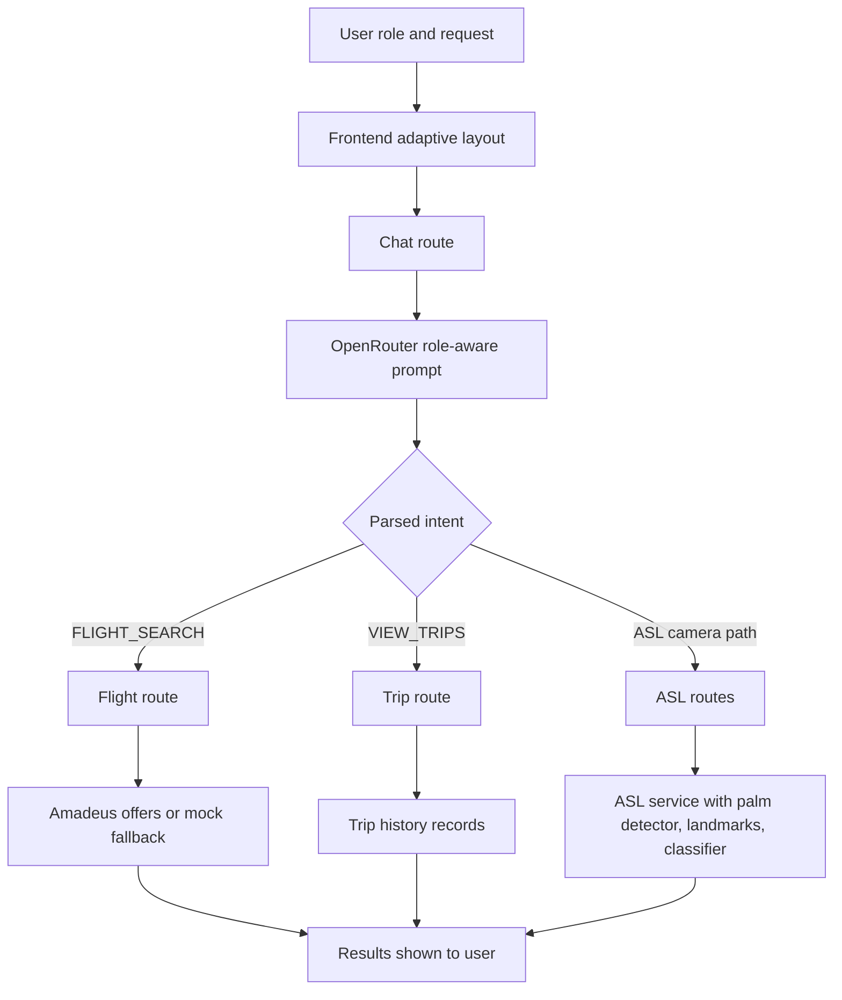

## SignChat

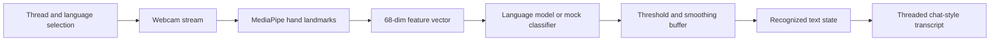

## CropIQ

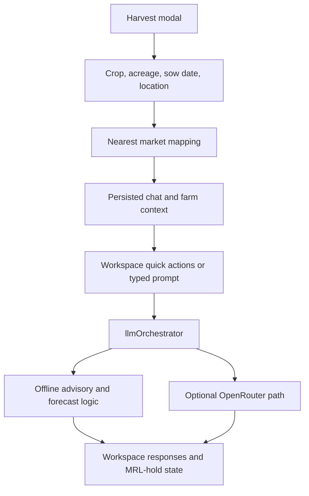

## LoanONE AI

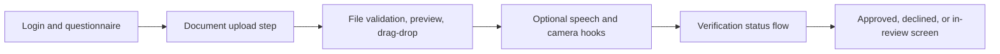

## AQI Forecasting

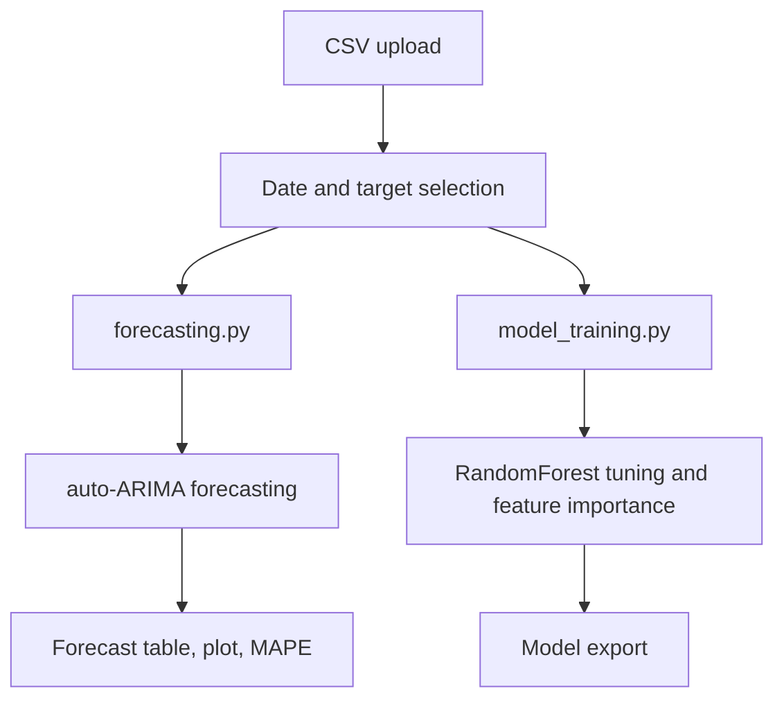

## RStudio Replica Forecasting App

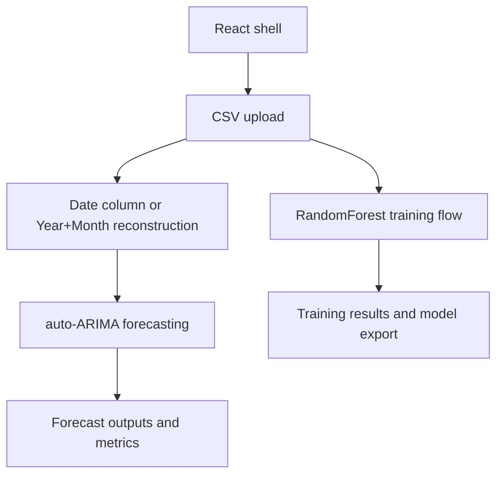

## Collaborative Filtering Recommendation Engine

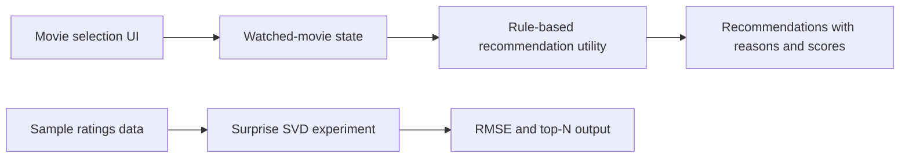

## SurgeMedi

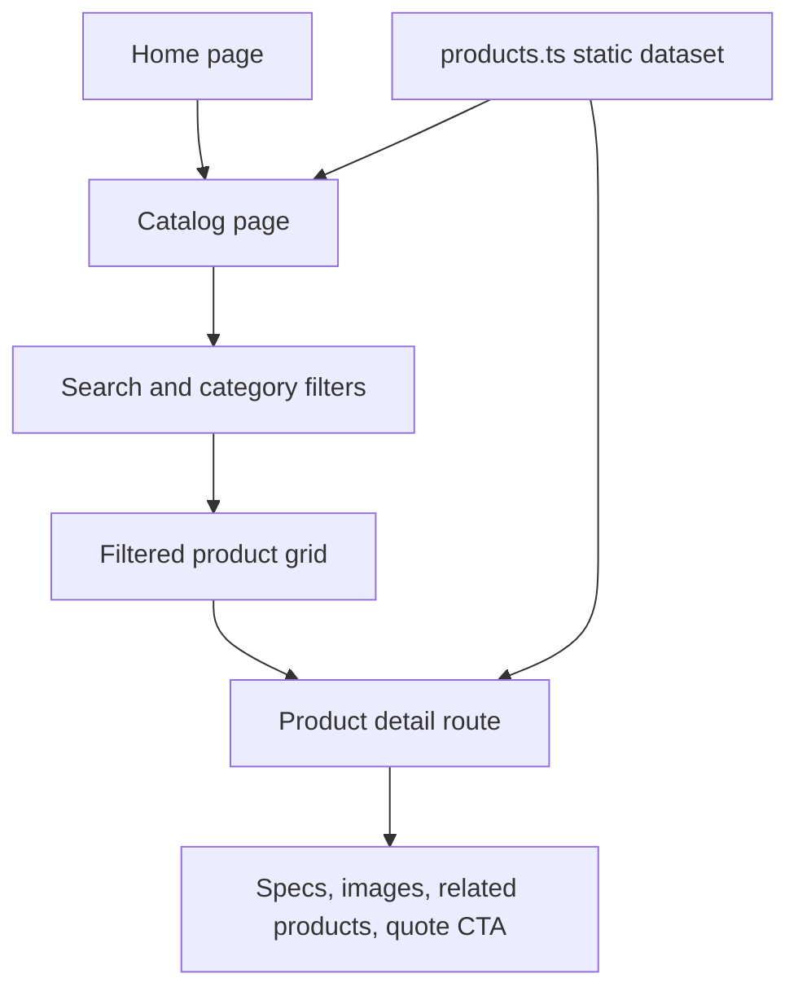

## Priority-Based CSV Sampler

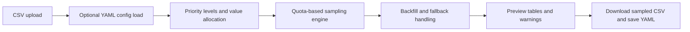

## GitHub Contribution Scheduler

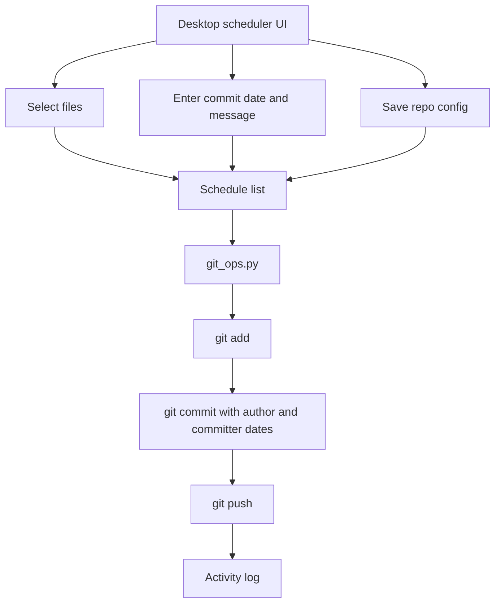
